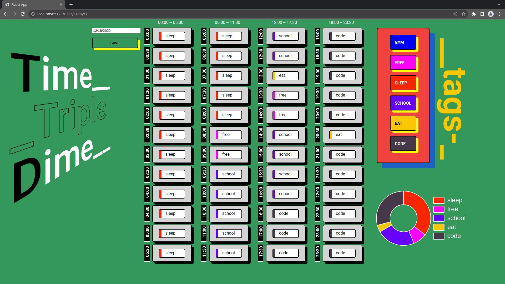
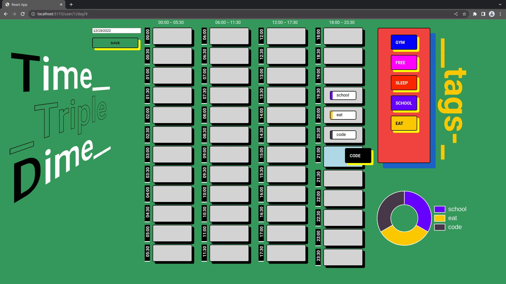
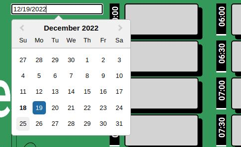
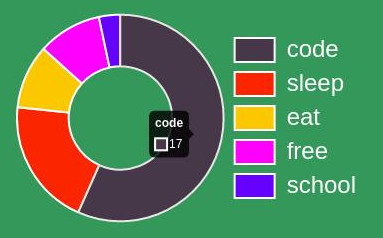
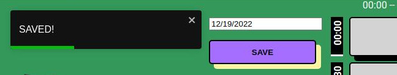

<!-- Improved compatibility of back to top link: See: https://github.com/othneildrew/Best-README-Template/pull/73 -->

<a name="readme-top"></a>

<!--
*** Thanks for checking out the Best-README-Template. If you have a suggestion
*** that would make this better, please fork the repo and create a pull request
*** or simply open an issue with the tag "enhancement".
*** Don't forget to give the project a star!
*** Thanks again! Now go create something AMAZING! :D
-->

<!-- PROJECT SHIELDS -->
<!--
*** I'm using markdown "reference style" links for readability.
*** Reference links are enclosed in brackets [ ] instead of parentheses ( ).
*** See the bottom of this document for the declaration of the reference variables
*** for contributors-url, forks-url, etc. This is an optional, concise syntax you may use.
*** https://www.markdownguide.org/basic-syntax/#reference-style-links
-->

[![LinkedIn][linkedin-shield]][linkedin-url]

<!-- PROJECT LOGO -->
<br />
<div align="center">
<h3 align="center">TimeTripleDime</h3>

  <p align="center">
  Final Project Capstone for BrainStation
    <br />

  </p>
</div>

<!-- TABLE OF CONTENTS -->
<details>
  <summary>Table of Contents</summary>
  <ol>
    <li>
      <a href="#about-the-project">About The Project</a>
      <ul>
        <li><a href="#built-with">Built With</a></li>
      </ul>
    </li>
    <li>
      <a href="#getting-started">Getting Started</a>
      <ul>
        <li><a href="#installation">Installation</a></li>
      <ul>
        <li><a href="#prequisites">Prequisites</a></li>
        <li><a href="#clone-the-project">Clone the project</a></li>
        <li><a href="#setting-up-the-backend-server">Setting up the BACKEND
        server</a></li>
        <li><a href="#setting-up-the-frontend">Setting up the FRONTEND client</a></li>
        <li><a href="#running-both-client-server">Running both client and
        server</a></li>
      </ul>
      </ul>
    </li>
    <li>
      <a href="#site-structure">Site Structure</a>
    </li>
    <li>
      <a href="#show-case">Show Case</a>
      <ul>
        <li>
          <a href="#functionality">Functionality</a>
          <ul>
            <li><a href="#drag-and-drop-from-tags-column">Drag and drop from
            tags column</a></li>
            <li><a href="#changing-date-from-the-date-picker">Changing date
            from the date picker </a></li>
            <li><a href="#donut-chart">Donut chart</a></li>
            <li><a href="#save-function">Save function</a></li>
          </ul>
        </li>
      </ul>
    </li>
    <li>
      <a href="#lessons-learned">Lessons Learned</a>
      <ul>
        <li><a href="#design-frontend">Design (FRONTEND)</a></li>
        <li><a href="#design-backend">Design (BACKEND)</a></li>
      </ul>
    </li>
    <li>
      <a href="#next-steps">Next Steps</a>
      <ul>
        <li><a href="#features">Features</a></li>
        <li><a href="#bug-fixes">Bug Fixes</a></li>
      </ul>
    </li>
    <li><a href="#contact">Contact</a></li>

  </ol>
</details>

<!-- ABOUT THE PROJECT -->

## About The Project

This is my Capstone Project for the BrainStation web development Sep-Dec
2022 cohort.

It is an app that visually clusters 30min blocks of a given day.

I chose this project because I am an avid time tracker. This was the perfect
chance to test what I have learned in the bootcamp as well as test how creative
I can be when designing the visuals of the app.

The app core functionality is to track how a user consumes a 30min block (48 of
these in a whole day) and visually presents it to the user.

A user can have a list of tags (a tag is an absolute activity description that can be
resused), and each tag can be dragged to the appropriate time slot.

Everytime a tag is dragged to a timeslot, the donut chart on the bottom right
gets populated dynamically. The donut chart legends description are also rendered
dynamically, if 3 tags are used, then the donut chart will only have 3 tags
visually represented.

Overall this project has challenged me greatly. I had to learn how to style my
components that fits the "neo brutalism" style. I also had to learn and deeply
research how to manipulate data in the database using SQL queries.

Enjoy the usage of my app as much as I had fun developing it.

Please look into the <a href="#show-case">Show Case</a> section for more
explanations on what I implemented on this project.

NOTE (to the TAs)
Explanations of the functionality of my app can be seen at the <a href="#site-structure">Site Structure</a> section.

<p align="right">(<a href="#readme-top">back to top</a>)</p>

### Built With

FRONTEND

- [![HTML][index.html]][html-url]
- [![CSS][main.css]][css-url]
- [![SASS][sass.scss]][sass-url]
- [![JS][javascript]][js-url]
- [![JS][react.jsx]][reactjs-url]

BACKEND

- [![NODE][node.js]][nodejs-url]
- [![EXPRESSJS][express.js]][expressjs-url]
- [![MYSQL][mysql]][mysql-url]

<p align="right">(<a href="#readme-top">back to top</a>)</p>

<!-- GETTING STARTED -->

## Getting Started

To get a local copy up and running follow these simple steps.

### Installation

#### Prequisites

Have mySQL installed with a default connection with user 'root' and password 'rootroot'

<a href="https://dev.mysql.com/doc/workbench/en/wb-installing-windows.html">
install mySQL workbench(Windows)
</a>
<br/>
<a href="https://dev.mysql.com/doc/workbench/en/wb-installing-linux.html">
install mySQL (Linux)
</a>
<br/>
<a href="https://dev.mysql.com/doc/workbench/en/wb-installing-mac.html">
install mySQL workbench(MacOS)
</a>
<br/>
<br/>

Make sure to create a database/schema called:

```sh
"Time3Dime_DB"
```

<a
href="https://stackoverflow.com/questions/5515745/create-a-new-database-with-mysql-workbench#:~:text=Those%20who%20are%20new%20to%20MySQL%20%26%20Mac%20users%3B%20Note%20that%2C%20Connection%20is%20different%20than%20Database.">
Creating a database/schema</a>

#### Clone the project

1. Clone the project repo

   ```sh
   git clone git@github.com:allansomera/allan-somera-capstone-time3dime.git
   ```

2. Enter the cloned project directory

   ```sh
   cd allan-somera-capstone-time3dime
   ```

#### Setting up the BACKEND server

1. go into the 'server' directory
   ```sh
   cd server
   ```
2. rename '.env.sample' to '.env'
   ```sh
   mv ./.env.sample .env
   ```
3. install all the packages
   ```sh
   npm i
   ```
4. Run all migrations and seeds
   ```sh
   npm run setup
   ```

#### Setting up the FRONTEND

1. go into the 'client' directory
   ```sh
   cd client
   ```
2. install all the packages
   ```sh
   npm i
   ```

#### Running both client and server

1. go into the 'server' directory
   ```sh
   cd server
   ```
2. run the start script
   ```sh
   npm run start
   ```
   <!-- LICENSE -->

## Site Structure

I would classify this as a single page app.
The landing route when the app is first mounted is:

```sh
"http://localhost:5173/user/1/day/1"
```

I have designed my app where in the future, it can used by many users after
they have signed up for an account.



## Show Case

### Functionality

#### Drag and drop from 'tags' column

```sh
You can choose a 'tag' from the 'tags' column to be dropped in a droppable
timeslot (00:00 to 23:30).

The color of the draggable tag will turn black with it's dropshadow remaining
as yellow.

The color of the droppable timeslot will change when a draggable item
is hovering on top of it.
```



#### Changing date from the date picker

```sh
You can change the date by clicking on a day from the datepicker. Upon clicking
on the date it will load the data on that given day.

If there was no previous data on the selected day, it will load 48 brand new
timeslots.

If the selected day had previous saved data, it will load that data from the
database.
```



#### Donut chart

```sh
Everytime a user drags a tag into timeslot, the donut chart gets rendered
dynamically. Essentially, this donut chart will count how many tags are used
within the day. The count that is represented on each section represents
30mins, you need to divide by 2 to get the total hours.
```



#### Save function

```sh
Upon clicking on the save button, it will save the current day and post the
data into the database.
```



## Lessons Learned

### Design (FRONTEND)

- What I learned from this whole capstone project is that you really do need to
  have a set design, even it it just a low fidelity wireframe. Having a set goal
  to how a component should like saves you a lot of time when actually styling it
  through css. <br/>

- Choose a theme/design and stick to it. Having a set theme makes it easy to
  design your components.

- Experiment. Once you have a clear goal in mind, now you can be more creative,
  you are able to style around this goal, and once you experimented how a
  certain component should look in different ways, you can choose which one
  will fit the best towards the flow of your site.

### Design (BACKEND)

- Take time how each data will saved into your database.

```sh
Each represented data entity => new table
ie:
user => user table
tag => tag table
user having a list tags = userBytag table
etc...
```

- take your time building the entity relationship diagram
- not only I had to learn how to use SQL queries, I also needed to transform them to
  be executed by knex query builder
- learned that each knex callback returns a promise, so I had to be
  mindful when speaking with the database that I don't have a whole bunch of
  knex promises executed at the same time (this populates your promise queue). It does affect performance when
  writing data to the approriate table(s)

## Next Steps

### Features

- Implement new account signup
- Implement habit tracking functionality
- Implement journal entry per day
- implement 'add' tag functionality per user
- implement a more extensive summary page
- implement the representation of 'hours' in the donut chart

### Bug Fixes

- Rewrite save functionality, having a null value on a timeslot is not handled
  properly in the save function
- Re-ordering of tags in tags column isn't implemented correctly

## License

Distributed under the MIT License. See `LICENSE.txt` for more information.

<p align="right">(<a href="#readme-top">back to top</a>)</p>

<!-- CONTACT -->

<p align="right">(<a href="#readme-top">back to top</a>)</p>

<!-- MARKDOWN LINKS & IMAGES -->
<!-- https://www.markdownguide.org/basic-syntax/#reference-style-links -->

[contributors-shield]: https://img.shields.io/github/contributors/allansomera/allan-somera-bandstie.svg?style=for-the-badge
[contributors-url]: https://github.com/allansomera/allan-somera-bandsite/graphs/contributors
[forks-shield]: https://img.shields.io/github/forks/allansomera/allan-somera-bandsite.svg?style=for-the-badge
[forks-url]: https://github.com/allansomera/allan-somera-bandsite/network/members
[stars-shield]: https://img.shields.io/github/stars/allansomera/allan-somera-bandsite.svg?style=for-the-badge
[stars-url]: https://github.com/allansomera/allan-somera-bandsite/stargazers
[issues-shield]: https://img.shields.io/github/issues/allansomera/allan-somera-bandsite.svg?style=for-the-badge
[issues-url]: https://github.com/allansomera/allan-somera-bandsite/issues
[license-shield]: https://img.shields.io/github/license/allansomera/allan-somera-bandsite.svg?style=for-the-badge
[license-url]: https://github.com/allansomera/allan-somera-bandsite/blob/master/LICENSE.txt
[linkedin-shield]: https://img.shields.io/badge/-LinkedIn-black.svg?style=for-the-badge&logo=linkedin&colorB=555
[linkedin-url]: https://linkedin.com/in/allansomera
[index.html]: https://img.shields.io/badge/HTML5-E34F26?style=for-the-badge&logo=html5&logoColor=white
[html-url]: https://developer.mozilla.org/en-US/docs/Web/HTML
[main.css]: https://img.shields.io/badge/CSS3-1572B6?style=for-the-badge&logo=css3&logoColor=white
[css-url]: https://developer.mozilla.org/en-US/docs/Learn/CSS
[sass.scss]: https://img.shields.io/badge/Sass-CC6699?style=for-the-badge&logo=sass&logoColor=white
[sass-url]: https://sass-lang.com/
[javascript]: https://img.shields.io/badge/JavaScript-F7DF1E?style=for-the-badge&logo=javascript&logoColor=black
[js-url]: https://javascript.com/
[express.js]: https://img.shields.io/badge/Express.js-404D59?style=for-the-badge
[expressjs-url]: https://expressjs.com/
[react.jsx]: https://img.shields.io/badge/React-20232A?style=for-the-badge&logo=react&logoColor=61DAFB
[reactjs-url]: https://reactjs.org/
[node.js]: https://img.shields.io/badge/Node.js-43853D?style=for-the-badge&logo=node.js&logoColor=white
[nodejs-url]: https://nodejs.org/
[mysql]: https://img.shields.io/badge/MySQL-00000F?style=for-the-badge&logo=mysql&logoColor=white
[mysql-url]: https://nodejs.org/
